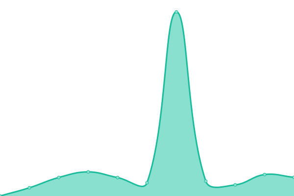

# [📈 Live Status](https://status.benfoster.dev): <!--live status--> **🟧 Partial outage**

This repository contains the open-source uptime monitor and status page for [Ben Foster](https://benfoster.dev), powered by [Upptime](https://github.com/upptime/upptime).

With [Upptime](https://upptime.js.org), you can get your own unlimited and free uptime monitor and status page, powered entirely by a GitHub repository. We use [Issues](https://github.com/benfoster04/status/issues) as incident reports, [Actions](https://github.com/benfoster04/status/actions) as uptime monitors, and [Pages](https://status.benfoster.dev) for the status page.

<!--start: status pages-->
<!-- This summary is generated by Upptime (https://github.com/upptime/upptime) -->
<!-- Do not edit this manually, your changes will be overwritten -->
<!-- prettier-ignore -->
| URL | Status | History | Response Time | Uptime |
| --- | ------ | ------- | ------------- | ------ |
|  [Nanseee Network N1](http://n1.nanseee.net) | Offline | [nanseee-network-n1.yml](https://github.com/benfoster04/status/commits/HEAD/history/nanseee-network-n1.yml) | 

 561ms
     
 | 

<a href="https://status.benfoster.dev/history/nanseee-network-n1">99.53%</a>
    

|  [Nanseee Network N2](http://n2.nanseee.net) | Online | [nanseee-network-n2.yml](https://github.com/benfoster04/status/commits/HEAD/history/nanseee-network-n2.yml) | 

 1912ms
     
 | 

<a href="https://status.benfoster.dev/history/nanseee-network-n2">99.76%</a>
    

|  [Canary Page](https://canary.benfoster.dev) | Online | [canary-page.yml](https://github.com/benfoster04/status/commits/HEAD/history/canary-page.yml) | 

 471ms
     
 | 

<a href="https://status.benfoster.dev/history/canary-page">100.00%</a>
    

|  [Main Site](https://benfoster.dev) | Online | [main-site.yml](https://github.com/benfoster04/status/commits/HEAD/history/main-site.yml) | 

 487ms
     
 | 

<a href="https://status.benfoster.dev/history/main-site">100.00%</a>
    

|  [ChooChoo API](https://benfoster.dev/choochoo/rug-bhm) | Online | [choo-choo-api.yml](https://github.com/benfoster04/status/commits/HEAD/history/choo-choo-api.yml) | 

 267ms
     
 | 

<a href="https://status.benfoster.dev/history/choo-choo-api">100.00%</a>
    

|  [Code Page](https://code.benfoster.dev) | Online | [code-page.yml](https://github.com/benfoster04/status/commits/HEAD/history/code-page.yml) | 

 486ms
     
 | 

<a href="https://status.benfoster.dev/history/code-page">100.00%</a>
    

<!--end: status pages-->

[**Visit our status website →**](https://status.benfoster.dev)

## 📄 License

- Powered by: [Upptime](https://github.com/upptime/upptime)
- Code: [MIT](./LICENSE) © [Ben Foster](https://benfoster.dev)
- Data in the `./history` directory: [Open Database License](https://opendatacommons.org/licenses/odbl/1-0/)
